# The Tale of Bikesharing in the United States

In this project we look at bikeshare data from bikeshare companies in
Boston (Hubway) and New York City (Citi Bikes). As bikesharing services
begin to roll out in many US cities, bike sharing is becoming a more
sustainable option for commuters. Or is it?? With the rise of
bikesharing services all across the United States, we decided that 2018
was a good time to look at the publicly available bikesharing data.

In the repository, we (Swopnil and Giang) have taken around 7 million
rides from publicly available data in both New York City and Boston and distributed our analysis into
many parts. Below is how we have documented the process of our data
analysis. This analysis will be divided into five parts.

## Overview of the Data

We began by combining the datasets from Boston and New York. We took the most relevant features and added them to our dataframes and wrote Python scripts to collect, combine and feature scale the information. The datasets included the following features:

1. Duration - time each bike was checked out for
1. Start time - the date and time that the bike was checked out
1. End time - the date and time that the bike was checked back in
1. Start longitude, Start latitude - the geographical coordinates of the station the bike was checked out from 
2. End longitude, End latitude - the geographical coordinates of the station the bike was checked back into
4. User Type - Whether the bike user was a registered user or one time user
5. Birth Year - Birth year of the user (some values were missing)
6. Gender - Male, Female, or Unknown

After making the dataset, we looked at the fundamental information of the dataset using Python Data Visulalization tools like `pandas` and `matplotlib`. 

### Distribution of Gender

 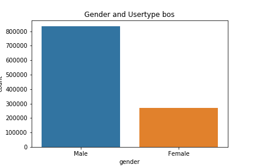

Looking at the data, there was an immediate observation about the gender distribution of bikeshare riders. It was that women were using bikeshare services way less than men. In New York City, the ratio of men to women was 70% to 30% whereas in Boston, this ratio was close to 80% to 20%. In either case, men were three or four times more likely to use bikeshare services. 

As to why women don't ride bicycles as much as men, there have been many theories including factors such as percieved safety mentioned in [this article by FiveThirtyEight](https://fivethirtyeight.com/features/why-women-dont-cycle/), and the data holds true to its claim. 

### Distribution of Trip Duration

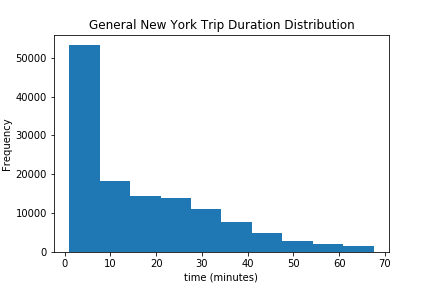 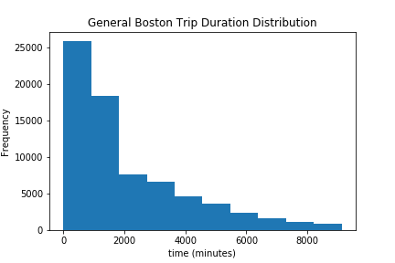

In regards to the duration of the rides, people in Boston were much more likely to have checked out the bikes for a longer time. While the range of duration time in New York is from 0 to 70 minutes, that in Boston is from 0 - 9000 minutes (about 6 days).

Since Citi Bikes puts a restriction of 30 minutes on bicycle checkout, most of the rides in New York were under 30 minutes. 

However in Boston, people checked the bikes out for a much longer period as there was a longer checkout period for the bikes. Hence a lot of people even checked out the bikes for 5 days. We then wonder about the special case with trips from Station A all the way to Station A. We find out that the percentages of same station trips in New York and Boston are 2.5 % (13,707 trips out of 5,562,321 total trips ) and 4.8% (76, 311 trips out of 1,579,025 total trips). 

#### Members and Nonmembers

We then continued to do some distribution of trip duration by the user type (member, and non-member). Here below are the histograms of New York and Boston's trip durations by the user types. We can easily observe that the number of members and non-member in New York is quite the same while most of riders in Boston is non-member.

  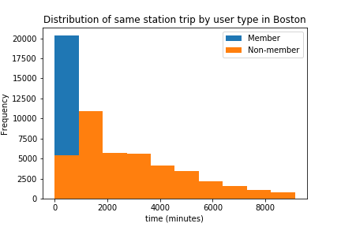

#### Accidental Checkouts 

For Citibike, the first 30 minutes of each ride are included in the price of the pass, and you can take as many rides as you want while your pass is active. If you keep a bike out for more than 30 minutes at a time, it’s an extra $4 per additional 15 minutes. Therefore, we will look up for the distribution of trip duration less than 30 minutes:

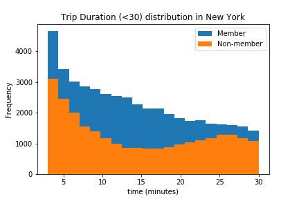 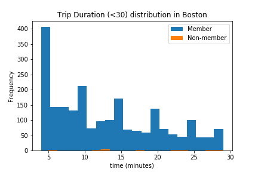

We notice that lots of trip durations are less than 3 minutes. We can regard less than three-minute trip duration is the accidental checkout. Therefore, the number of accidentals checkouts in New York and Boston are 32668 and 4751 respectively. Here are the distribution of duration trips < 30 minutes of two cities after dropping all the accidental checkouts:

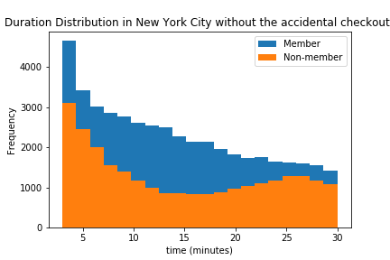 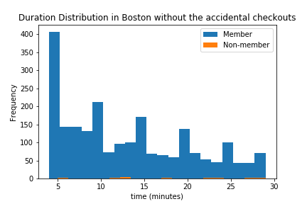

We can observe that the graphs with and without accidental checkouts are not different a lot. Therefore, we can conclude that the number of accidental checkouts doesn't affect the model of two datasets a lot.

### Distribution by Age
The next question is "How does bikeshare service usage differ by age?". Taking a closer look at the main data. We can see that the distribution of age is skewed to the right. The majority of the users are between their 30s-50s. A reason for the use of bicycles for the current demographic could be 2 reasons in my opinion: 1. As people earn more, they stray away from bicycles. Hence people with higher median earnings (who generally tend to be older, could use other means of transportation) 2. While the bicycles are cheaper than taxis and ride hailing apps, they are more expensive than the metro in NYC or Boston. Demographics with a lower income, generally 20 year olds or older could use the metro otherwise.

  !

## What Happens in a Day

### In a day

In one day in a city like Boston or New York City, a lot of activity takes place in different areas of towns. In essence, the data is also a reflection of what New Yorkers or people in Boston live their lives. 

Looking at activity by time of day, we can see that even during late nights some New Yorkers are still active on their bicycles. 

In the midst of dusk and dawn around 3 am is the lowest bicycle traffic. The distribution is bimodal containing two peaks representing the two times that New Yorkers rush in and our of work; these take place around 8am and between 5-7pm. 

The higher peak in the evening hours could also have been affected by more tourists choosing to ride the bicycles or more people biking around for recreation. 

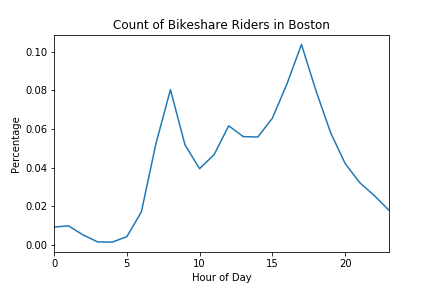

Boston also follows a similar peak where the traffic drops drastically around 8pm until around 7am when it rises back to a peak and drops for the midday until around mega rush hour. 

The similarity of these peaks tells us that the location (in this case New York City or Boston) does not that that much effect on the bike riding trend. 

In fact, if we combine both plots we almost get the same plot again. 

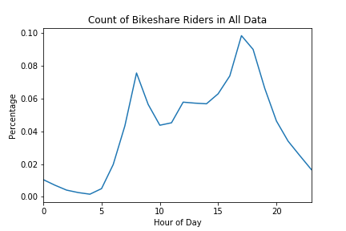

### By day of the year

if we look at riders by the day of the week, the data adds a clear picture of the seasonal cycling trends in both cities. People tend to go out during the summer and spring month and enjoy the sun and the weather whereas stay indoors specially in the snowy northeast. 

This trend is reflected by the annual trends. 

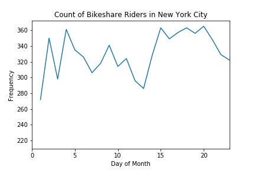

In New York City, there is almost no traffic in the months of January and February, whereas as the seasons pass, fall has the highest traffic. This could also be directly related to weather trends. 

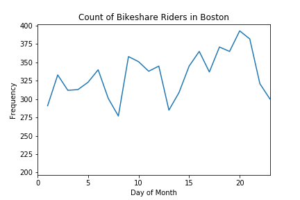

Boston contains a similar picture. Sometimes even the services close down during deep snow winter months in the cities so there is hardly any usage data for the rides during this time. Even Boston usage peaks around September and late August before the fall. 

## Looking from Above

How did we setup the datasets like we did. Before we setup the data,
firstly let's setup the data like we did.

Firstly, in a terminal window clone the git repository. Lorem ipsum
dolor sit amet, consectetur adipiscing elit. Nam dictum venenatis eros
sed dignissim. Vestibulum nisi lorem, bibendum ut est ut, pharetra
mattis enim. Aenean blandit ut nulla vehicula blandit. Duis non lectus
laoreet, ornare velit sit amet, vestibulum odio. Nullam fringilla
sodales justo. Morbi quis turpis maximus, vehicula massa sed, commodo
tortor. Interdum et malesuada fames ac ante ipsum primis in faucibus.
Suspendisse sed est a velit cursus imperdiet. Ut est diam, dignissim
eget metus eu, semper tincidunt nulla.

Duis volutpat in lorem et vehicula. Fusce fringilla, est in pulvinar
accumsan, diam ligula auctor lorem, vitae ultrices ante ex in urna.
Pellentesque pellentesque ultricies ligula, eu posuere risus eleifend
nec. Sed vulputate sollicitudin magna, pulvinar fringilla magna cursus
id. Cras ut ex sit amet nulla aliquet eleifend vel sed arcu. Suspendisse
quis convallis arcu. Nunc gravida quis tellus sed placerat. Nunc
facilisis suscipit augue, ut tincidunt mi vulputate sed.

Maecenas efficitur magna sed fermentum pretium. Aliquam mattis ante et
vestibulum fermentum. Phasellus efficitur maximus eros. Quisque vitae
tortor erat. Phasellus id iaculis massa, imperdiet sollicitudin ante.
Aenean ultricies ex erat. Proin vehicula nunc eu nulla scelerisque, non
porta metus laoreet. Mauris tincidunt ante elit, et cursus justo
pellentesque vel. Morbi ut pulvinar est. Maecenas arcu quam, mattis
vitae quam et, sodales porta ante. Orci varius natoque penatibus et
magnis dis parturient montes, nascetur ridiculus mus. Aliquam erat
volutpat. Pellentesque a tempor lorem, non fermentum nulla. Suspendisse
potenti.

Donec efficitur faucibus tellus ac rhoncus. Nam condimentum interdum
lorem nec hendrerit. Sed id nunc lectus. Integer cursus mauris suscipit
arcu bibendum, non ullamcorper turpis vestibulum. Sed aliquet, dui sit
amet feugiat condimentum, ex ipsum faucibus magna, sit amet lacinia
lorem nisl a velit. Nam facilisis ullamcorper porttitor. Donec finibus,
diam a finibus volutpat, lacus

## From Here to There

How did we setup the datasets like we did. Before we setup the data,
firstly let's setup the data like we did.

Firstly, in a terminal window clone the git repository. Lorem ipsum
dolor sit amet, consectetur adipiscing elit. Nam dictum venenatis eros
sed dignissim. Vestibulum nisi lorem, bibendum ut est ut, pharetra
mattis enim. Aenean blandit ut nulla vehicula blandit. Duis non lectus
laoreet, ornare velit sit amet, vestibulum odio. Nullam fringilla
sodales justo. Morbi quis turpis maximus, vehicula massa sed, commodo
tortor. Interdum et malesuada fames ac ante ipsum primis in faucibus.
Suspendisse sed est a velit cursus imperdiet. Ut est diam, dignissim
eget metus eu, semper tincidunt nulla.

Duis volutpat in lorem et vehicula. Fusce fringilla, est in pulvinar
accumsan, diam ligula auctor lorem, vitae ultrices ante ex in urna.
Pellentesque pellentesque ultricies ligula, eu posuere risus eleifend
nec. Sed vulputate sollicitudin magna, pulvinar fringilla magna cursus
id. Cras ut ex sit amet nulla aliquet eleifend vel sed arcu. Suspendisse
quis convallis arcu. Nunc gravida quis tellus sed placerat. Nunc
facilisis suscipit augue, ut tincidunt mi vulputate sed.

Maecenas efficitur magna sed fermentum pretium. Aliquam mattis ante et
vestibulum fermentum. Phasellus efficitur maximus eros. Quisque vitae
tortor erat. Phasellus id iaculis massa, imperdiet sollicitudin ante.
Aenean ultricies ex erat. Proin vehicula nunc eu nulla scelerisque, non
porta metus laoreet. Mauris tincidunt ante elit, et cursus justo
pellentesque vel. Morbi ut pulvinar est. Maecenas arcu quam, mattis
vitae quam et, sodales porta ante. Orci varius natoque penatibus et
magnis dis parturient montes, nascetur ridiculus mus. Aliquam erat
volutpat. Pellentesque a tempor lorem, non fermentum nulla. Suspendisse
potenti.

Donec efficitur faucibus tellus ac rhoncus. Nam condimentum interdum
lorem nec hendrerit. Sed id nunc lectus. Integer cursus mauris suscipit
arcu bibendum, non ullamcorper turpis vestibulum. Sed aliquet, dui sit
amet feugiat condimentum, ex ipsum faucibus magna, sit amet lacinia
lorem nisl a velit. Nam facilisis ullamcorper porttitor. Donec finibus,
diam a finibus volutpat, lacus

## Conclusion

How did we setup the datasets like we did. Before we setup the data,
firstly let's setup the data like we did.

Firstly, in a terminal window clone the git repository. Lorem ipsum
dolor sit amet, consectetur adipiscing elit. Nam dictum venenatis eros
sed dignissim. Vestibulum nisi lorem, bibendum ut est ut, pharetra
mattis enim. Aenean blandit ut nulla vehicula blandit. Duis non lectus
laoreet, ornare velit sit amet, vestibulum odio. Nullam fringilla
sodales justo. Morbi quis turpis maximus, vehicula massa sed, commodo
tortor. Interdum et malesuada fames ac ante ipsum primis in faucibus.
Suspendisse sed est a velit cursus imperdiet. Ut est diam, dignissim
eget metus eu, semper tincidunt nulla.

Duis volutpat in lorem et vehicula. Fusce fringilla, est in pulvinar
accumsan, diam ligula auctor lorem, vitae ultrices ante ex in urna.
Pellentesque pellentesque ultricies ligula, eu posuere risus eleifend
nec. Sed vulputate sollicitudin magna, pulvinar fringilla magna cursus
id. Cras ut ex sit amet nulla aliquet eleifend vel sed arcu. Suspendisse
quis convallis arcu. Nunc gravida quis tellus sed placerat. Nunc
facilisis suscipit augue, ut tincidunt mi vulputate sed.

Maecenas efficitur magna sed fermentum pretium. Aliquam mattis ante et
vestibulum fermentum. Phasellus efficitur maximus eros. Quisque vitae
tortor erat. Phasellus id iaculis massa, imperdiet sollicitudin ante.
Aenean ultricies ex erat. Proin vehicula nunc eu nulla scelerisque, non
porta metus laoreet. Mauris tincidunt ante elit, et cursus justo
pellentesque vel. Morbi ut pulvinar est. Maecenas arcu quam, mattis
vitae quam et, sodales porta ante. Orci varius natoque penatibus et
magnis dis parturient montes, nascetur ridiculus mus. Aliquam erat
volutpat. Pellentesque a tempor lorem, non fermentum nulla. Suspendisse
potenti.

Donec efficitur faucibus tellus ac rhoncus. Nam condimentum interdum
lorem nec hendrerit. Sed id nunc lectus. Integer cursus mauris suscipit
arcu bibendum, non ullamcorper turpis vestibulum. Sed aliquet, dui sit
amet feugiat condimentum, ex ipsum faucibus magna, sit amet lacinia
lorem nisl a velit. Nam facilisis ullamcorper porttitor. Donec finibus,
diam a finibus volutpat, lacus
